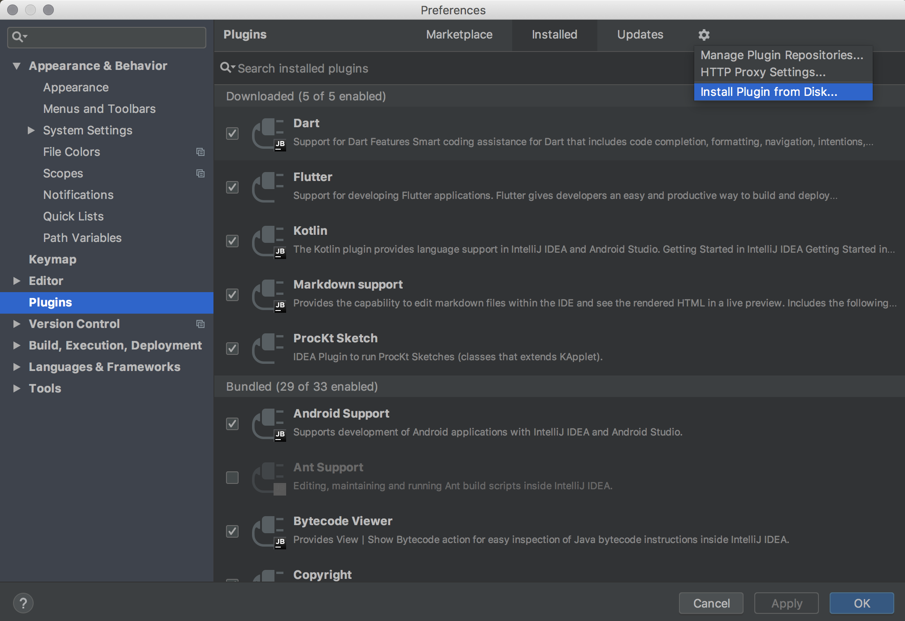

# ProcKt Plugin for Jetbrains IDEA

A [Jetbrains IDEA](https://www.jetbrains.com/idea) plugin to launch sketches created in [ProcKt](https://github.com/fiskurgit/ProcKtTemplate). It replicates the ⌘-r behaviour in the [Processing IDE](https://processing.org)

## Download

* [Download fisk.prokt-0.0.2.jar](/build/libs/fisk.prockt-0.0.2.jar)

## Usage

###  `⌘`+`shift`+`w`

The plugin runs whichever sketch (a class that extends KApplet) has focus in the editor, it lets you quickly see the results of what you're currently coding.

* Download and install this plugin in [Jetbrains IDEA](https://www.jetbrains.com/idea), use _Install Plugin from Disk..._ (see screenshot below).
* Clone and open [ProcKt Template](https://github.com/fiskurgit/ProcKtTemplate)
* Create a sketch (or open an example in the editor)
* Quickly run the currently active sketch using `⌘`+`shift`+`w` or choose Run from the ProcKt menu

I had more ambitious plans for this but the Jetbrains Plugin documentation is abysmal and life is short.